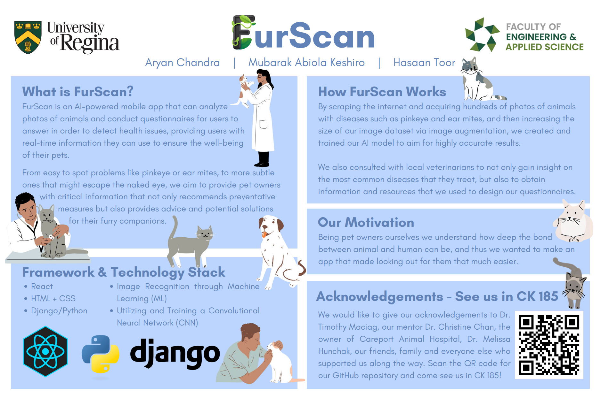

# FurScan



## Members
* Hasaan Toor
* Aryan Chandra
* Mubarak Abiola Keshiro

## Mentor
* Christine Chan - Ph.D., P.Eng.

## Project Idea
Our capstone project aims to develop an AI-powered mobile app that can analyse photos of animals and accurately detect health issues, such as pink eye, providing users with real-time information to ensure the well-being of their pets.

## Project Background/Business Opportunity
At the core of our capstone project lies a profound "why" - a mission to enhance the well-being of pets and the peace of mind of their owners. Many times pet owners are faced with the dilemma of whether their beloved animals require veterinary care or not. This uncertainty can majority of the time lead to delayed treatment, potentially worsening a pet's suffering or even causing irreversible harm. 

Our innovation strives to bridge this gap by using artificial intelligence and computer vision. By analyzing photos of animals, our app can quickly and accurately identify health problems, from common ailments like pink eye to more subtle issues that might escape the human eye. This technology not only gives pet owners critical information but also serves as a preventative measure, enabling early intervention when necessary. Ultimately, our project seeks to strengthen the human-animal bond and ensure the best possible care for our furry companions.

## Installation Instructions
1. Install Django:
```
pip install Django
```
2. Clone repository:
```
git clone https://github.com/HasaanToor/FurScan
```
3. Navigate to the project directory:
```
cd Application
```
4. Run the Django development server
```
python manage.py runserver
```
6. Open [http://127.0.0.1:8000/](http://127.0.0.1:8000/) to view the project.
 
## Vlogs
* [Vlog 1](https://www.youtube.com/watch?v=oTGdbxi8asQ)
* [Vlog 2](https://www.youtube.com/watch?v=A2CbUuWAKgw)
* [Vlog 3](https://www.youtube.com/watch?v=9Z44IviPvpc)

## Demo and Commercial
* [Application Demo. How to use our app!](https://www.youtube.com/watch?v=FRidz-tvH48)
* [Commercial Video](https://www.youtube.com/watch?v=q5QgG3sSOmM)
